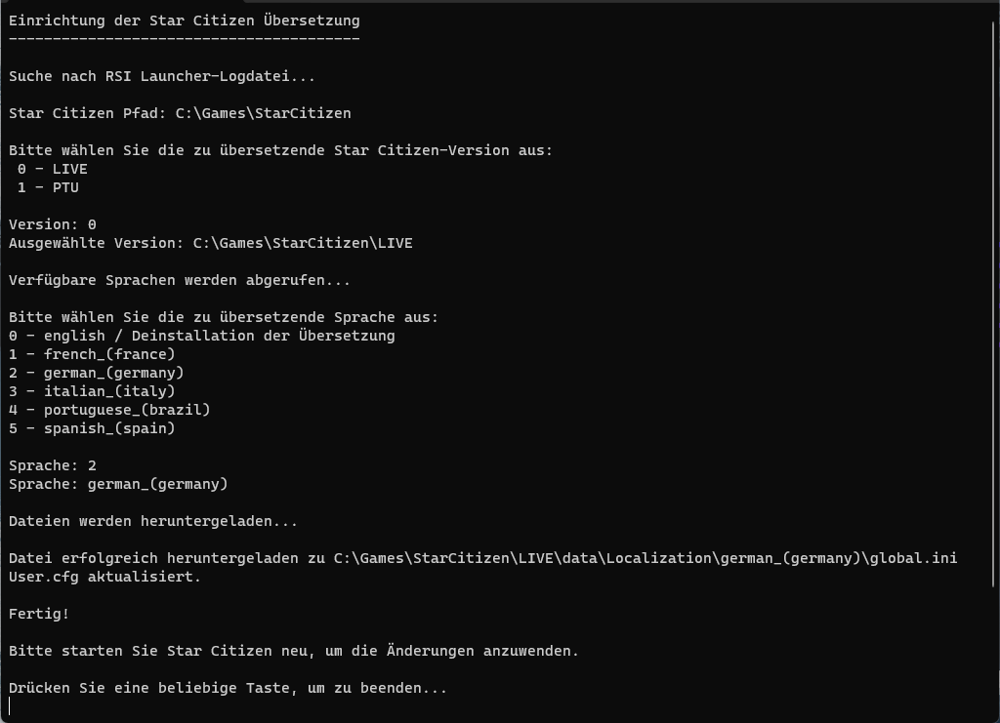

## SC-TranslationSetup Tool

- 🇬🇧 [Instructions in English.](README.md).
- 🇫🇷 [Instruction en Français](README_fr.md).
- 🇩🇪 [Anleitung auf Deutsch](README_de.md).
- 🇪🇸 [Instrucciones en Español](README_es.md).
- 🇮🇹 [Istruzioni in Italiano](README_it.md).
- 🇧🇷 [Instrução em Português](README_ptbr.md).
- 🇹🇷 [Türkçe talimatlar](README_tr.md).

Willkommen im `SC-TranslationSetup`-Repository, dem bevorzugten Einrichtungstool für die Lokalisierung von Star Citizen unter Verwendung der Übersetzungen aus dem [StarCitizen-Localization](https://github.com/Dymerz/StarCitizen-Localization)-Repository. Dieses Tool wurde entwickelt, um die Installation von Lokalisierungsdateien zu vereinfachen und ein nahtloses Erlebnis für Spieler zu gewährleisten, die Star Citizen in ihrer bevorzugten Sprache genießen möchten.

# Beispiel auf Deutsch

### Funktionen

- **Einfache Installation:** Vereinfacht den Prozess der Installation von Lokalisierungsdateien in Star Citizen.
- **Findet automatisch die Star Citizen-Installation:** Versucht, die Star Citizen-Installation zu finden und fragt Sie nach der Version (LIVE/PTU,...), die Sie installieren möchten.
- **Unterstützung mehrerer Sprachen:** Kompatibel mit allen Sprachen, die im StarCitizen-Localization-Repo bereitgestellt werden.
- **Benutzerfreundliche Schnittstelle:** Intuitives Design für eine problemlose Bedienung.
- **Automatische Updates:** Holt automatisch die neuesten Übersetzungen aus dem StarCitizen-Localization-Repository bei jedem Lauf.

### Download

Laden Sie die neueste Version des SC-TranslationSetup-Tools herunter:

🔗 [SC-TranslationSetup.exe herunterladen](https://github.com/ROBdk97/SC-TranslationSetup/releases/latest/download/SC-TranslationSetup.exe)

### Installation

1. **Laden Sie das Tool herunter:** Klicken Sie auf den oben genannten Link, um `SC-TranslationSetup.exe` herunterzuladen.
2. **Führen Sie die ausführbare Datei aus:** Doppelklicken Sie auf die heruntergeladene Datei, um den Installationsassistenten zu starten.

### Benutzung

- **Starten Sie das Tool:** Öffnen Sie `SC-TranslationSetup.exe`.
- **Folgen Sie den Anweisungen**

### Support

Bei Problemen oder Fragen öffnen Sie bitte ein Issue in diesem Repository oder kontaktieren Sie uns über das [StarCitizen-Localization](https://github.com/Dymerz/StarCitizen-Localization)-Repository.

### Mitwirken

Beiträge sind immer willkommen! Bitte beziehen Sie sich auf das [StarCitizen-Localization](https://github.com/Dymerz/StarCitizen-Localization)-Repository für Richtlinien zur Mitarbeit an den Übersetzungsdateien.

### Lizenz

Details finden Sie in der Datei LICENSE.

---

Viel Spaß beim Spielen von Star Citizen in Ihrer Sprache! 🚀🌌

---
## Haftungsausschluss
Dies ist eine inoffizielle Star Citizen-Fanseite, nicht verbunden mit der Cloud Imperium-Unternehmensgruppe. Alle Inhalte auf dieser Website, die nicht vom Host oder den Nutzern verfasst wurden, sind Eigentum ihrer jeweiligen Besitzer. Star Citizen®, Roberts Space Industries® und Cloud Imperium® sind eingetragene Marken von Cloud Imperium Rights LLC.
