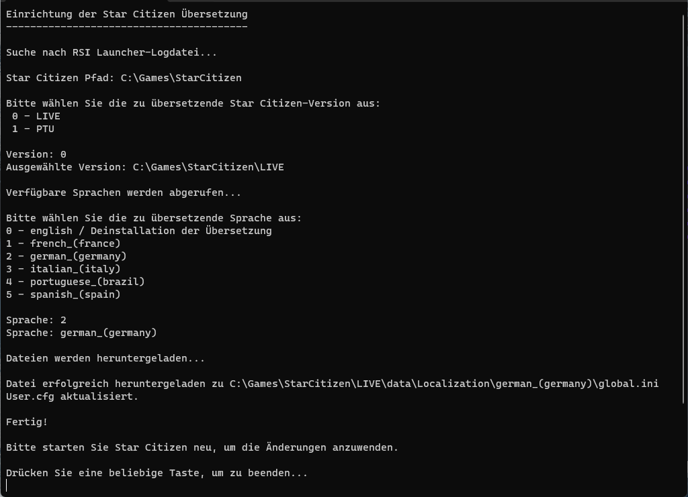

## Herramienta SC-TranslationSetup

- ???? [Instructions in English.](README.md).
- ???? [Instruction en Fran?ais](README_fr.md).
- ???? [Anleitung auf Deutsch](README_de.md).
- ???? [Instrucciones en Espa?ol](README_es.md).
- ???? [Istruzioni in Italiano](README_it.md).
- ???? [Instru??o em Portugu那s](README_ptbr.md).

Bienvenido al repositorio `SC-TranslationSetup`, la herramienta de configuraci車n ideal para localizar Star Citizen utilizando las traducciones del repositorio [StarCitizen-Localization](https://github.com/Dymerz/StarCitizen-Localization). Esta herramienta est芍 dise?ada para simplificar la instalaci車n de archivos de localizaci車n, asegurando una experiencia fluida para los jugadores que buscan disfrutar de Star Citizen en su idioma preferido.

# Ejemplo en Alem芍n

### Caracter赤sticas

- **Instalaci車n F芍cil:** Simplifica el proceso de instalar archivos de localizaci車n en Star Citizen.
- **Encuentra autom芍ticamente la instalaci車n de Star Citizen:** Intenta encontrar la instalaci車n de Star Citizen y te pregunta la versi車n (LIVE/PTU, etc.) que deseas instalar.
- **Soporte Multilenguaje:** Compatible con todos los idiomas proporcionados en el repo de StarCitizen-Localization para descargar y en la aplicaci車n.
- **Interfaz Amigable al Usuario:** Dise?o intuitivo para una operaci車n sin complicaciones.
- **Actualizaciones Autom芍ticas:** Busca autom芍ticamente las 迆ltimas traducciones del repositorio StarCitizen-Localization en cada ejecuci車n.

### Descarga

Obt谷n la 迆ltima versi車n de la Herramienta SC-TranslationSetup:

?? [Descargar SC-TranslationSetup.exe](https://github.com/ROBdk97/SC-TranslationSetup/releases/latest/download/SC-TranslationSetup.exe)

### Instalaci車n

1. **Descargar la Herramienta:** Haz clic en el enlace de arriba para descargar `SC-TranslationSetup.exe`.
2. **Ejecutar el Ejecutable:** Haz doble clic en el archivo descargado para lanzar el asistente de instalaci車n.

### Uso

- **Lanzar la Herramienta:** Abre `SC-TranslationSetup.exe`.
- **Sigue las instrucciones**

### Soporte

Para cualquier problema o pregunta, por favor abre un problema en este repositorio o cont芍ctanos a trav谷s del repositorio [StarCitizen-Localization](https://github.com/Dymerz/StarCitizen-Localization).

### Contribuir

?Las contribuciones son siempre bienvenidas! Por favor, consulta el repositorio [StarCitizen-Localization](https://github.com/Dymerz/StarCitizen-Localization) para obtener directrices sobre c車mo contribuir a los archivos de traducci車n.

### Licencia

Consulta el [LICENSE](LICENSE.txt) para m芍s detalles.

---

?Disfruta jugando Star Citizen en tu idioma! ????

---
## Descargo de responsabilidad
Este es un sitio de fans no oficial de Star Citizen, no afiliado con el grupo de empresas Cloud Imperium. Todo el contenido en este sitio que no sea creado por su anfitri車n o usuarios es propiedad de sus respectivos due?os. Star Citizen?, Roberts Space Industries? y Cloud Imperium? son marcas registradas de Cloud Imperium Rights LLC