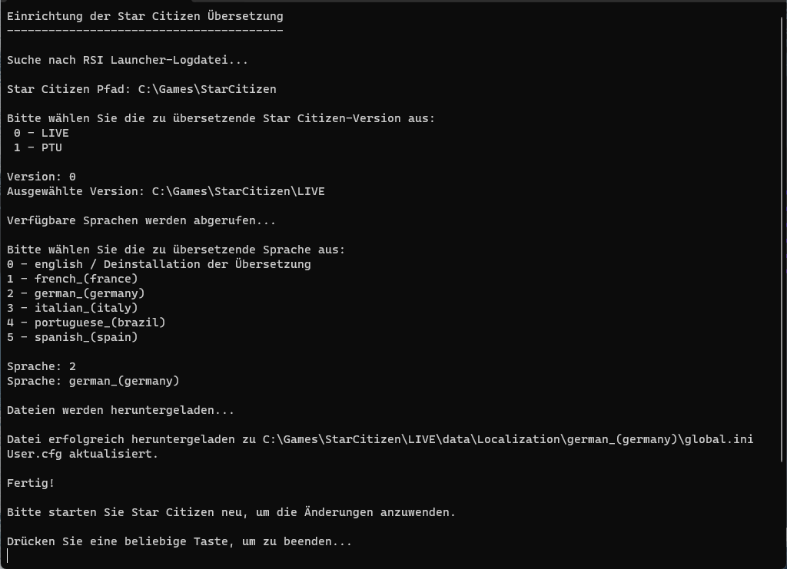

## Herramienta SC-TranslationSetup

- 🇬🇧 [Instructions in English.](README.md).
- 🇫🇷 [Instruction en Français](README_fr.md).
- 🇩🇪 [Anleitung auf Deutsch](README_de.md).
- 🇪🇸 [Instrucciones en Español](README_es.md).
- 🇮🇹 [Istruzioni in Italiano](README_it.md).
- 🇧🇷 [Instrução em Português](README_ptbr.md).
- 🇹🇷 [Türkçe talimatlar](README_tr.md).

Bienvenido al repositorio `SC-TranslationSetup`, la herramienta de configuración ideal para localizar Star Citizen utilizando las traducciones del repositorio [StarCitizen-Localization](https://github.com/Dymerz/StarCitizen-Localization). Esta herramienta está diseñada para simplificar la instalación de archivos de localización, asegurando una experiencia sin problemas para los jugadores que buscan disfrutar de Star Citizen en su idioma preferido.

# Ejemplo en Alemán

### Características

- **Instalación Fácil:** Simplifica el proceso de instalar archivos de localización en Star Citizen.
- **Encuentra automáticamente la instalación de Star Citizen:** Intenta encontrar la instalación de Star Citizen y te pregunta la versión (LIVE/PTU,..) que quieres instalar.
- **Soporte Multilenguaje:** Compatible con todos los idiomas proporcionados en el repositorio StarCitizen-Localization para descargar y en la aplicación.
- **Interfaz Amigable al Usuario:** Diseño intuitivo para una operación sin complicaciones.
- **Actualizaciones Automáticas:** Obtiene automáticamente las últimas traducciones del repositorio StarCitizen-Localization en cada ejecución.

### Fuentes comunitarias adicionales

El repositorio objetivo principal de esta aplicación es [Dymerz/StarCitizen-Localization](https://github.com/Dymerz/StarCitizen-Localization).

La herramienta también incluye otras fuentes de idioma seleccionadas y mantenidas por la comunidad:

- [`MrKraken/StarStrings`](https://github.com/MrKraken/StarStrings) - versión inglesa no oficial con ajustes de la comunidad.
- [`ExoAE/ScCompLangPack`](https://github.com/ExoAE/ScCompLangPack) - versión inglesa no oficial con ajustes de la comunidad.
- [`rjcncpt/StarCitizen-Deutsch-INI`](https://github.com/rjcncpt/StarCitizen-Deutsch-INI) - opciones comunitarias en alemán y alemán suizo.

El propietario de cada repositorio personalizado se muestra en la selección de idioma dentro de la aplicación.

El repositorio [`rjcncpt/StarCitizen-Deutsch-INI`](https://github.com/rjcncpt/StarCitizen-Deutsch-INI) indica que parte de su contenido se ofrece bajo la licencia CC-BY-NC-SA-4.0. Consulta ese repositorio para ver los términos de atribución y reutilización.

### Descarga

Obtén la última versión de la Herramienta SC-TranslationSetup:

🔗 [Descargar SC-TranslationSetup.exe](https://github.com/ROBdk97/SC-TranslationSetup/releases/latest/download/SC-TranslationSetup.exe)

### Instalación

1. **Descarga la Herramienta:** Haz clic en el enlace de arriba para descargar `SC-TranslationSetup.exe`.
2. **Ejecuta el Archivo:** Haz doble clic en el archivo descargado para lanzar el asistente de instalación.

### Uso

- **Lanza la Herramienta:** Abre `SC-TranslationSetup.exe`.
- **Sigue las instrucciones**

### Soporte

Para cualquier problema o pregunta, por favor abre un problema en este repositorio o contáctanos a través del repositorio [StarCitizen-Localization](https://github.com/Dymerz/StarCitizen-Localization).

### Contribuir

¡Las contribuciones son siempre bienvenidas! Por favor, consulta el repositorio [StarCitizen-Localization](https://github.com/Dymerz/StarCitizen-Localization) para obtener directrices sobre cómo contribuir a los archivos de traducción.

### Licencia

Consulta el [LICENSE](LICENSE.txt) para más detalles.

---

¡Disfruta jugando Star Citizen en tu idioma! 🚀🌌

---
## Descargo de responsabilidad
Este es un sitio de fans no oficial de Star Citizen, no afiliado al grupo de empresas Cloud Imperium. Todo el contenido en este sitio no autorizado por su anfitrión o usuarios es propiedad de sus respectivos dueños. Star Citizen®, Roberts Space Industries® y Cloud Imperium® son marcas registradas de Cloud Imperium Rights LLC